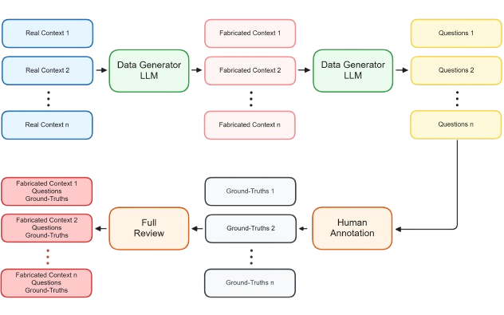

# Context is King: Large Language Models' Interpretability in Divergent Knowledge Scenarios

## 📝 Overview

This repository accompanies the research paper **"[Context is King: Large Language Models' Interpretability in Divergent Knowledge Scenarios](https://www.mdpi.com/2076-3417/15/3/1192)"**, published in *Applied Sciences*. The study presents a novel approach to interpretability in large language models (LLMs) through the **Context-Driven Divergent Knowledge Evaluation (CDK-E)** methodology, which tests models' alignment with context-specific information that may differ from their internal knowledge. This approach aims to provide a unique perspective in explainable AI (XAI) by focusing on how LLMs interpret and adapt to contextual knowledge divergence.

The CDK-E methodology employs a custom-built **Divergent Knowledge Dataset (DKD)**, designed to fabricate divergent contexts, allowing researchers to evaluate how well models rely on provided information rather than pre-existing knowledge. This repository includes all the necessary resources to replicate or expand upon the experiments presented in the paper.



*Overview of the Divergent Knowledge Dataset (DKD) fabrication process.*

The **CDK-E methodology** is designed to test the interpretability of large language models (LLMs) by evaluating their alignment with context-specific information that diverges from their inherent knowledge. This approach offers a complementary framework to traditional explainable AI (XAI) techniques, emphasizing context-based alignment as a measure of interpretability.


*Diagram of the key components and process flow of the Context-Driven Divergent Knowledge Evaluation (CDK-E) methodology.*

___


## 📂 Repository Contents

- **📁 `dataset/`**: Includes the **Divergent Knowledge Dataset (DKD)**, comprising modified contexts, questions, and ground-truth answers used to test the models’ reliance on provided context rather than their internal knowledge.
- **📁 `prompts/`**: Includes the **prompts** used in the study for inference in the models.
  
## 🏅 Key Findings

The following table and graph show some of the results with GPT-4 Turbo as evaluator model.

| Evaluated Model  | LAV Precision | Accuracy | Completeness | Answer Similarity (ASS) | Answer Correctness (AC) |
|------------------|---------------|----------|--------------|-------------------------|-------------------------|
| **GPT-3.5**      | 94.2%         | 92.1%    | 90.3%        | 95.7%                   |76.1%                    |
| **GPT-4o**       | **96.6%**     |**93.1%** |**91.4%**     |**97.1%**                |**80.8%**                |
| **Llama 3**      | 92.8%         | 88.8%    | 62.3%        | 87.3%                   |52.2%                    |
| **Mixtral 8x7B** | 84.8%         | 82.4%    | 77.7%        | 92.1%                   |66.0%                    |

*Summarized results comparing model performance on key metrics with GPT-4 Turbo as evaluator. Full results can be found in the paper.*


*Correlation between weighted LLM-based metrics (LAV, Accuracy, Completeness) and Answer Semantic Similarity (ASS) across different models with GPT-4 Turbo as evaluator*

___


## ✉️ Contact

For questions or collaboration inquiries, please reach out to Andrés Piñeiro-Martín at [andres.pineiro@balidea.com](mailto:andres.pineiro@balidea.com) or [apinheiro@gts.uvigo.es](mailto:apinheiro@gts.uvigo.es).

___


## 📖 Citation

If you use the materials or methodology from this repository and the study, please cite our paper as follows:

```bibtex
@Article{app15031192,
AUTHOR = {Piñeiro-Martín, Andrés and Santos-Criado, Francisco-Javier and García-Mateo, Carmen and Docío-Fernández, Laura and López-Pérez, María del Carmen},
TITLE = {Context Is King: Large Language Models’ Interpretability in Divergent Knowledge Scenarios},
JOURNAL = {Applied Sciences},
VOLUME = {15},
YEAR = {2025},
NUMBER = {3},
ARTICLE-NUMBER = {1192},
URL = {https://www.mdpi.com/2076-3417/15/3/1192},
ISSN = {2076-3417},
ABSTRACT = {Large language models (LLMs) have revolutionized the field of artificial intelligence in both academia and industry, transforming how we communicate, search for information, and create content. However, these models face knowledge cutoffs and costly updates, driving a new ecosystem for LLM-based applications that leverage interaction techniques to extend capabilities and facilitate knowledge updates. As these models grow more complex, understanding their internal workings becomes increasingly challenging, posing significant issues for transparency, interpretability, and explainability. This paper proposes a novel approach to interpretability by shifting the focus to understanding the model’s functionality within specific contexts through interaction techniques. Rather than dissecting the LLM itself, we explore how contextual information and interaction techniques can elucidate the model’s thought processes. To this end, we introduce the Context-Driven Divergent Knowledge Evaluation (CDK-E) methodology, along with the Divergent Knowledge Dataset (DKD), for evaluating the interpretability of LLMs in context-specific scenarios that diverge from the model’s inherent knowledge. The empirical results demonstrate that advanced LLMs achieve high alignment with divergent contexts, validating our hypothesis that contextual information significantly enhances interpretability. Moreover, the strong correlation between LLM-based metrics and semantic metrics confirms the reliability of our evaluation framework.},
DOI = {10.3390/app15031192}
}
```
___


## 📝 License

Licensed under the Apache License, Version 2.0 (the "License");
you may not use this file except in compliance with the License.
You may obtain a copy of the License at

    http://www.apache.org/licenses/LICENSE-2.0

Unless required by applicable law or agreed to in writing, software
distributed under the License is distributed on an "AS IS" BASIS,
WITHOUT WARRANTIES OR CONDITIONS OF ANY KIND, either express or implied.
See the License for the specific language governing permissions and
limitations under the License.

